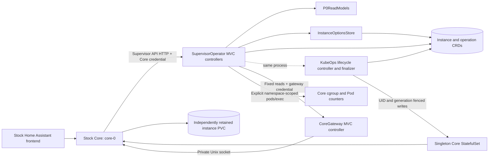

# Architecture

This document describes the P0 compatibility spike and implemented [P1 Core lifecycle foundation](p1-foundation.md). The [implementation plan](implementation-plan.md) defines subsequent milestones, and the [technology decision](tech-stack.md) records the accepted C#/.NET stack. P1 adds namespace-scoped reconciliation, durable operations, admission and Helm packaging; its fresh full acceptance suite passed on 2026-10-04. Add-on lifecycle remains later work.

## Components and request flow

Core runs its released image and native entrypoint, loading its built-in `hassio` integration through `SUPERVISOR` and `SUPERVISOR_TOKEN`. Core supplies the UI; the project does not replace or patch that frontend. Its stable Supervisor-managed HTTP listener uses port 80. Tests forward it to runner loopback port 18123.

`SupervisorOperator` hosts the Supervisor-compatible API. `InfoController` provides startup and installation reads, `CoreController` provides Core reads and exact proxy routes, `CapabilitiesController` exposes the empty or unavailable P0 capabilities, and `OptionsController` accepts validated native callbacks. Controllers translate HTTP requests into service calls and explicit response contracts. `SupervisorApi` registers dependencies, controller discovery, JSON settings and credential/error middleware. It does not define business endpoints through minimal API delegates.

`CoreGateway` is a separate sidecar executable. Its controller exposes health, measured Pod network metadata, Core status and Core configuration. `CoreSocketClient` connects only to the configured absolute Unix socket, and offers two fixed reads: `/api/` and `/api/config`. It never falls back to TCP. Controller discovery is restricted to each application's assembly, including in test hosts.

| Location | Responsibility |
| --- | --- |
| `src/Supervisor.Contracts` | Explicit upstream wire DTOs and success/error envelopes |
| `src/SupervisorOperator` | API controllers, credential/error middleware, read models, option persistence and Core metrics |
| `src/SupervisorOperator/Foundation` | Opt-in namespace-scoped KubeOps probe, durable acceptance status and owned projection cleanup |
| `src/SupervisorOperator/Lifecycle` | Instance/operation entities, lifecycle acceptance, reconciliation, health, fencing and shutdown |
| `charts/home-assistant-supervisor-operator` | P1 chart, structural CRDs, RBAC, singleton admission and retained storage |
| `src/CoreGateway` | Authenticated, narrowly scoped access to Core's private socket |
| `src/SharedRuntime` | Shared measured cgroup and network-counter helpers |
| `deploy/p0.yaml` | P0 singleton workloads, Services, PVCs, credentials references and namespace-scoped RBAC |
| `tools/DevGuard` and `hack/` | Runtime identity, sealed kubeconfig, network guards and disposable test lifecycle |
| `contracts/baseline.json` | Committed compatibility inventory used by verification, not runtime routing |
| `tests/` | Wire-contract/state/isolation tests and native client/browser E2E scenarios |

## Contracts and errors

The Supervisor API serializes snake_case names and retains meaningful null metadata. Successful reads use `{ "result": "ok", "data": ... }`; rejected operations use `{ "result": "error", "message": ... }` with explicit error status codes. Exact Core proxy reads preserve the upstream response body, content type and status instead of wrapping it. Gateway reads likewise preserve Core's response.

The API supports native `/core` and legacy `/homeassistant` aliases. Options accept a bounded subset and validate the whole body before updating state. Manual body parsing preserves native empty-body, malformed-JSON and unsupported-field behavior rather than introducing MVC's default validation response format. Update requests return the tested no-upgrade error. Unknown capabilities and v2 routes do not claim success.

The [contract baseline](contract-baseline.md) records pinned upstream routes, client models and bundled frontend calls, with each route classified. Strict regeneration detects drift. Static inventory coverage and native behavior coverage are separate evidence; neither establishes compatibility with every upstream operation.

## State and lifecycle

In the installed P1 operator, `InstanceOptionsStore` uses resourceVersion-checked instance CR writes for timezone, country, diagnostics and Core HTTP callbacks. GitOps ownership rejects UI changes while permitting unchanged bootstrap callbacks. P0 and local API fixtures retain the atomic file store. Core's native configuration belongs to Core/the user on the retained instance PVC.

P1's combined API/operator Deployment uses `Recreate`; its controller owns one `OnDelete` Core StatefulSet with a gateway sidecar. Admission enforces the singleton across instance configurations, installations and scaling. API commands commit to the CR before HTTP waiting; operations recover after process interruption. Restart waits for the old Pod to disappear before starting Core, then verifies readiness and native socket application health. All workload writes carry instance UID, monotonic generation and resourceVersion fencing. Unreachable Pods block replacement. Kubernetes selects Core placement subject to the PVC topology; the operator supplies no Core node selector. Template upgrades stop Core before recreating immutable workloads. The gateway Service publishes not-ready addresses to avoid a startup readiness cycle.

Jobs project bounded durable operation records; basic logs use fixed current Pod/container targets. The Core PVC has no CR owner reference and is kept by Helm. Finalization and the chart's pre-delete shutdown hook wait for graceful termination while retaining configuration. No controller force-deletes Pods or moves data to another node. Physical fencing remains an administrator responsibility.

## Credentials and isolation

Core's credential authenticates the Supervisor API, with the native header precedence preserved. Only ping and liveness are public. The gateway has a separate credential and rejects query parameters. Caller-selected upstream paths, credentials and commands are not accepted. Credentials are compared using constant-time hashes and never belong in committed fixtures or exported diagnostics.

The API runs non-root. The gateway runs as root because stock Core's Unix socket is root-owned with mode 0600; it drops all capabilities, uses a read-only root filesystem and has no Kubernetes service-account credentials. The Core workload also disables service-account token mounting.

Core metrics use a fixed read-only exec command against `core-0` in the installed namespace. Only the installed API workload explicitly opts into in-cluster credentials, using its downward-API namespace and narrow RBAC. Local API runs cannot select ambient hosting-cluster credentials. Statistics represent actual container/Pod counters; host disk values describe the operator filesystem (the P0 compatibility-state filesystem or P1 temporary storage), not Core PVC capacity. Unobserved node and HAOS metadata remain null, and the installation reports unsupported status with visible limitations.

Project tests use only the dedicated nested Docker daemon and a verified project-owned kind cluster. DevGuard seals daemon/node identity and generated kubeconfig, rejects ambient credentials and remote runtime inputs, and checks bridge MTU against the runner interface. These configuration guards do not establish platform firewall enforcement or production hardware/LAN support.

## Verification boundary

The fresh suite owns setup, image loading, real scheduling/DNS/PVC Jobs, inventory comparison, RBAC/client checks, browser scenarios, diagnostics and teardown. Browser scenarios exercise native onboarding, existing-account startup, Settings/Apps/store, repairs, uploads, proxy behavior, restart persistence and HTTP migration. A separate injected-failure gate checks real cleanup. See [development](development.md) for commands and actual results.

P1 does not provide add-on installation, backups, updates, authenticated add-on ingress or hardware management. Its disposable framework probe remains a separate development fixture. P1 gates include real lifecycle/UI checks, watch reconnect, schema defaults, immutable upgrades and a live Core worker partition with physical fencing. These kind checks do not establish production CSI, LAN, device or multi-architecture compatibility.

## Deployment and P0 closeout

The supported P0 deployment path is the guarded development runner: `dev-up.sh` creates a project-owned kind cluster, and `dev-load.sh` builds and loads local application images, creates credentials, and applies `deploy/p0.yaml`. The manifest uses the fixed `haso-p0` namespace and preloaded images with `imagePullPolicy: Never`. It is a development fixture, not a user installation package. The full suite owns this deployment and removes it after verification; no test installation remains running after closeout.

P0 closes with MVC controller-based HTTP services, the pinned compatibility inventory, architecture/contribution documentation and green native client/browser tests. The [development evidence](development.md#coverage-and-evidence) records 70 passing .NET tests, the fresh full E2E run, development-image checks and verified success/failure teardown.

The P1 chart accepts administrator-supplied application image references, credentials and storage. Optional frontend ingress/TLS assumes an existing ingress controller and native Core trusted-proxy configuration. The public alpha release predates the removal of Core pinning; current source and subsequent artifacts allow scheduler-selected placement. See [installation, ownership and upgrade instructions](p1-foundation.md#installing-the-development-preview). Later milestones add add-on lifecycle, ingress authentication, backups and updates.
