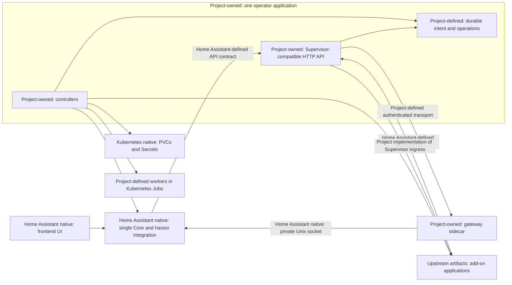

# Home Assistant Supervisor operator: research and implementation plan

Research date: 2026-10-02. Implementation update: 2026-10-03. P0 is complete: the stock Core compatibility spike, development image, fresh full suite and success/failure teardown gates passed in isolated kind. HTTP endpoints use ASP.NET Core MVC controllers. P1 framework probe work has started; production Kubernetes reconciliation and later milestone features remain planned.

## Objective and recommendation

Run Home Assistant Core and compatible add-ons on Kubernetes while allowing users to install, configure, start, stop, update, and back up those workloads through Home Assistant's existing UI.

Build one application that runs both the Kubernetes operator and the Supervisor-compatible HTTP API. API handlers implement Home Assistant's wire contracts; controllers translate durable intent into workloads. The installation manages exactly one Home Assistant instance in one namespace, with at most one active Core process. Multiple instances and parallel Core replicas are outside the design. Keep the original Home Assistant and add-on images wherever possible. Begin with a single selected Linux node and persistent storage; expand workload placement only after shared-volume and hardware constraints are tested.

This is a substantial compatibility project. Success means the normal UI and add-on scripts work, not merely that REST handlers create Pods. Supervisor also coordinates Core updates/rollback, backups, application services, and supporting infrastructure. [Supervisor responsibilities](https://developers.home-assistant.io/docs/supervisor/).

The project will provide its own compatibility guarantee. Kubernetes is not an official Home Assistant installation method; upstream ended support for the Supervised installation method after 2025.12. Do not identify this implementation as Home Assistant OS to suppress installation warnings. [Upstream installation policy](https://www.home-assistant.io/blog/2025/05/22/deprecating-core-and-supervised-installation-methods-and-32-bit-systems/).

## Research baseline

Use released Core **2026.9.4**, Supervisor **2026.09.3**, and Core's pinned **aiohasupervisor 0.6.0** as the first contract baseline. Their release identifiers are research inputs, not a promise that the operator already supports them. [Core release](https://github.com/home-assistant/core/releases/tag/2026.9.4), [Supervisor release](https://github.com/home-assistant/supervisor/releases/tag/2026.09.3), [Core client dependency](https://github.com/home-assistant/core/blob/2026.9.4/homeassistant/components/hassio/manifest.json).

Development branches inspected for drift:

| Repository | Commit |
| --- | --- |
| Supervisor main | `bdcba61fc7c1500e96d2e319d07546f7b896e067` |
| Core dev | `c4035b579cd5ef437cdff269436027ba861d784e` |
| Frontend dev | `655e11ac1cd043fd26113054558b985eac217c95` |

Frontend revision was recorded, but this research primarily verified Core and Supervisor source. Milestone 0 must inspect and exercise the frontend bundled with the selected Core release.

Public documentation is an overview; release-tagged route registration, handlers, Core integration, and client models determine exact behavior. September's Supervisor already contains a feature-gated `/v2` API with `apps` terminology. Implement the unprefixed v1 contracts first, keep v2 serialization separate, and enable v2 only after client testing. Avoid treating v2 as a simple URL alias: payload names and statistics differ. [Released route registration](https://github.com/home-assistant/supervisor/blob/2026.09.3/supervisor/api/__init__.py), [Response serialization](https://github.com/home-assistant/supervisor/blob/bdcba61fc7c1500e96d2e319d07546f7b896e067/supervisor/api/utils.py).

## Integration contracts that shape the design

### Core bootstrap and communication

Core's `hassio` integration requires `SUPERVISOR` and `SUPERVISOR_TOKEN`. Supply an internal gateway address in the former, with no URL scheme, and a Core-specific credential in the latter. Verify automatic integration loading in the stock container during Milestone 0.

Fresh onboarding calls Supervisor update before coordinator initialization. When no operator update is offered, return the compatible bad-request response; returning success can make Core wait indefinitely for an update. Support Core's option callbacks for timezone/country and API configuration. [Released Core bootstrap](https://github.com/home-assistant/core/blob/2026.9.4/homeassistant/components/hassio/__init__.py).

The released integration fetches root, Core, Supervisor, OS, host, store, network, ingress panels, and mount information. Jobs, installed add-ons, stats, issues, and discovery have their own consumers. Even an unsupported component may need a valid read model so initialization succeeds. Missing endpoints or invalid enum values can break the integration before an add-on is installed. [Released coordinators](https://github.com/home-assistant/core/blob/2026.9.4/homeassistant/components/hassio/coordinator.py).

Modern Core provides a dedicated Supervisor Unix socket. Configure `SUPERVISOR_CORE_API_SOCKET=/run/supervisor/core.sock` and share an `emptyDir` between Core and a local gateway. Restrict this socket to those two containers: it authenticates the Supervisor system user without a normal user token. September's Core removes old Supervisor refresh tokens; copying an older token-exchange implementation would be incorrect. [Released Supervisor connection implementation](https://github.com/home-assistant/supervisor/blob/2026.09.3/supervisor/homeassistant/api.py), [Released Core container configuration](https://github.com/home-assistant/supervisor/blob/2026.09.3/supervisor/docker/homeassistant.py).

### API, authentication, and UI

Preserve response envelopes (`result`, `data`, or error `message`), HTTP statuses, field types, nullability, error details, and operation-specific completion behavior. Logs, icons, archives, event streams, and WebSockets need their own transport contracts. Do not substitute Kubernetes's HTTP 201/202 conventions for expected Supervisor replies. [API response helpers](https://github.com/home-assistant/supervisor/blob/bdcba61fc7c1500e96d2e319d07546f7b896e067/supervisor/api/utils.py).

Mint separate random credentials for Core and each installed add-on. Support the token headers expected by the baseline client, resolve `self` from authenticated identity, enforce per-route/method roles and manifest permissions, and redact other add-ons' options. Add-ons must never receive Core's credential or Kubernetes workload-management credentials. Preserve Core-only operations. [Security middleware](https://github.com/home-assistant/supervisor/blob/bdcba61fc7c1500e96d2e319d07546f7b896e067/supervisor/api/middleware/security.py), [Security roles](https://developers.home-assistant.io/docs/apps/security/).

UI calls travel through Core HTTP and WebSocket handlers. Current UI work should target Core's built-in settings/app interfaces; the historical Supervisor frontend panels are deprecated. Contract testing must include UI commands, not assume all calls are HTTP requests to `/api/hassio`. [Core HTTP proxy](https://github.com/home-assistant/core/blob/c4035b579cd5ef437cdff269436027ba861d784e/homeassistant/components/hassio/http.py), [Released WebSocket handlers](https://github.com/home-assistant/core/blob/2026.9.4/homeassistant/components/hassio/websocket_api.py), [Frontend development note](https://developers.home-assistant.io/docs/supervisor/development/).

Add-ons use `http://supervisor`, a Supervisor bearer credential, a Core API proxy, and predictable add-on hostnames. Services registered by add-ons are application-level metadata, potentially including credentials; a Kubernetes Service alone does not implement this contract. [Application communication](https://developers.home-assistant.io/docs/apps/communication/), [Services handler](https://github.com/home-assistant/supervisor/blob/bdcba61fc7c1500e96d2e319d07546f7b896e067/supervisor/api/services.py).

Core proxy authorization needs separate enforcement even where general middleware skips token validation. Block add-ons from calling Core's Supervisor loopback/auth routes or privileged `hassio/` and `supervisor/` WebSocket commands through the privileged proxy. Test encoded paths and credential forwarding. [Core proxy implementation](https://github.com/home-assistant/supervisor/blob/bdcba61fc7c1500e96d2e319d07546f7b896e067/supervisor/api/proxy.py).

## Capability scope and Kubernetes mapping

The following is a family-level implementation backlog, not a complete method/schema specification. Milestone 0 produces the exact route manifest from the baseline sources and client usage. P0 proves UI integration; P1 provides the useful initial release; P2 extends compatibility. Reject excluded mutations explicitly rather than returning successful no-ops.

| Capability / route family | Proposed backend | Priority / limits |
| --- | --- | --- |
| Root `/info`; Supervisor ping, info, options | Instance state and capability model | P0; separate API compatibility version from operator build version |
| `/core` info, options, start, stop, restart, check, rebuild, update | Singleton workload; persisted operations; check Job | P0 reads; P1 mutations and health-gated updates |
| `/core/api`, stream and WebSocket proxies | Local gateway to Core socket | P1; retain legacy aliases required by clients |
| `/store` catalog, repositories, assets, availability, reload | Git metadata worker and persistent cache | P1; validate before displaying an add-on as installable |
| Store install/update, including explicit versions | Add-on CR and durable operation | P1; support old install/update aliases where registered |
| `/addons` list/info/options/validation/rendered configuration | Catalog plus CRs and Secrets | P0 read model; P1 configuration and schema behavior |
| Add-on start/stop/restart/uninstall/security/sys_options | StatefulSet replica count, revision, policy, finalizers | P1; preserve data; system-managed ownership and Core-only restrictions |
| Add-on rebuild and local repositories | Isolated image-build Job and registry | P2; reject build-only add-ons until enabled |
| Add-on stdin | Pod attach to actual main-process stdin | P2; enable stdin at creation; exec is not equivalent |
| Core/add-on/Supervisor logs and follow | Kubernetes Pod logs adapter | P1 basic logs; historical boot/journal semantics P2 or explicitly limited |
| Core/add-on/Supervisor stats | Metrics adapter with explicit units and sampling | P0 typed responses; P1 real supported metrics; no fabricated counters |
| `/jobs` | Durable operation records and progress projection | P0; Supervisor jobs are not identical to Kubernetes batch Jobs |
| `/ingress` panels/session/validation/proxy | Authenticated HTTP/WebSocket gateway | P0 panel read; P1 actual UI routing |
| `/services` and `/discovery` | Registry, owner identity, Secrets, Core callbacks | P1; clean up on removal and replay after restart |
| `/backups` metadata, creation, upload/download, restore, freeze/thaw | Worker Jobs, archive storage, operation lock | P1 release gate; interoperability developed in Milestone 4 |
| `/auth` and permitted user/cache/reset operations | Core auth endpoints through socket | P1 for auth-enabled add-ons; privileged mutations strictly scoped |
| `/resolution` issues/suggestions/checks | Translate operator conditions into validated API issue models | P0 reads; only implement meaningful Kubernetes remedies |
| `/host`, `/network`, `/os`, `/mounts` info | Honest instance/node metadata and empty/disabled models where needed | P0 typed reads; no HAOS identity |
| Host reboot/shutdown, NetworkManager writes, OS update/data-disk/boot control | No generic safe equivalent | Excluded from initial scope; never implicitly reboot a cluster node |
| `/hardware` | Selected node/device inventory | P2; only report devices actually available to the instance |
| `/audio` | Optional node-local audio service | P2; gate audio-dependent applications |
| `/dns`, `/multicast` | Kubernetes DNS adapter; explicit LAN discovery profile | P0 necessary reads; P2 configurable infrastructure adapters |
| `/cli`, `/observer`, `/docker`, `/security`, `/time` | Explicit capability/read adapters where consumed | P0 required reads; P2 useful equivalents; Docker socket unavailable |
| Supervisor reload/restart/repair/update; update feeds | Cache refresh, gateway restart, reconciliation, operator release policy | P1; cluster admin controls operator upgrades by default |

API families and legacy routes were checked against [Supervisor route registration](https://github.com/home-assistant/supervisor/blob/2026.09.3/supervisor/api/__init__.py). Per-family behavior should be verified against [Core handlers](https://github.com/home-assistant/supervisor/blob/bdcba61fc7c1500e96d2e319d07546f7b896e067/supervisor/api/homeassistant.py), [add-on handlers](https://github.com/home-assistant/supervisor/blob/bdcba61fc7c1500e96d2e319d07546f7b896e067/supervisor/api/apps.py), and [store handlers](https://github.com/home-assistant/supervisor/blob/bdcba61fc7c1500e96d2e319d07546f7b896e067/supervisor/api/store.py).

## Proposed architecture

Use C# on .NET 10 LTS with ASP.NET Core and run the HTTP API and controllers in the same process, executable, and Deployment. KubeOps is the accepted controller framework, using the official KubernetesClient library; the P1 foundation validated namespace-scoped reconciliation and recovery. Keep HTTP handlers and reconciliation as separate internal modules sharing domain types and business rules. See [the technology stack decision](tech-stack.md) for accepted choices, acceptance criteria, and version pinning. Use one repository with separate gateway and worker executables/images where their dependencies and permissions differ. These are supporting components, not separately deployed API and operator services. Implement add-on schema validation in C#; revisit additional tooling only if a demonstrated compatibility gap requires it.

### Component ownership

**Project-owned** means we implement code or define configuration and resource specifications. **Home Assistant native** means existing Core code that we reuse. **Upstream artifacts** means add-on images and manifests supplied by Home Assistant or community maintainers. **Kubernetes native** means existing cluster primitives and infrastructure; we define their manifests and reconcile them. These labels describe the proposed implementation boundary, not completed work.

The Supervisor API contract is defined by Home Assistant, but the API server in this design is our implementation. We replace the upstream Supervisor runtime with Kubernetes-backed behavior. Home Assistant Core, its frontend, and its `hassio` integration remain native. The upstream Supervisor container is not deployed.

| Component or contract | What we reuse | What we implement or define |
| --- | --- | --- |
| Core and frontend UI | Home Assistant native container, automation engine, settings/app UI, and onboarding | Workload manifest, image selection, environment, storage, probes, exposure, and lifecycle reconciliation |
| Core `hassio` integration | Native Supervisor client, HTTP/WebSocket handlers, discovery consumers, and Core auth endpoints | Compatible responses and callbacks; test against the native integration without modifying Core |
| Core private Unix socket | Native socket server and Supervisor-user behavior | Socket environment/path and shared volume; restricted gateway client and sidecar |
| Supervisor-compatible API | Home Assistant-defined routes, payloads, roles, error models, and completion semantics | HTTP server, authorization, validation, read models, and translation into durable operations |
| Operator controllers | Kubernetes APIs and validated KubeOps framework | Reconciliation, singleton enforcement, operation fencing, update/recovery workflows, and resource ownership |
| Durable state and CRDs | Kubernetes custom-resource persistence, Secrets, and status mechanics | All five CRD schemas below, state transitions, retention, and projections into Supervisor models |
| Add-on applications | Official/community images, entrypoints, manifests, options schemas, assets, and application logic; these are upstream artifacts, not necessarily Home Assistant-maintained code | Catalog ingestion, manifest interpretation, capability checks, configuration files, workload manifests, and lifecycle management |
| Add-on ingress | Native frontend entry points and upstream add-on web servers; Home Assistant-defined session/proxy contract | Session store, validation, authenticated HTTP/WebSocket proxy, routing, and header handling |
| Services and discovery | Home Assistant-defined registry payloads and native Core discovery integration | Registry persistence, add-on ownership checks, reachable endpoint translation, callbacks, and replay |
| Backups and updates | Home Assistant-defined API/archive contracts and application backup hooks | Backup workers, quiescing, encryption/archive compatibility, restore orchestration, image updates, and rollback coordination |
| Pods, StatefulSets, Services, PVCs, Secrets, Jobs, and RBAC | Kubernetes native resource types and controllers | Their manifests, selectors, mounts, permissions, scheduling, and reconciliation; worker programs where needed |
| DNS, storage, and networking infrastructure | Cluster DNS, CNI, CSI, and optional ingress controller supplied by the cluster | Required settings, integration checks, naming/exposure policy, and optional compatibility adapters |

Each row in the capability mapping above describes behavior implemented by this project unless explicitly identified as a native Core endpoint or upstream application. Referencing a Supervisor endpoint does not mean the original Supervisor implements it for us.

**One operator application, one Home Assistant instance.** A singleton operator Deployment runs both reconciliation and the Supervisor API. Expose its HTTP listener through the namespace-local `supervisor` Service. It handles control requests, cached read models, logs, and operation tracking, and remains running when Core is stopped. Use one replica and a Recreate strategy for this Deployment; operation state persists across restarts. Operator upgrades may briefly interrupt the API while Core and add-ons continue running.

A small gateway sidecar in Core's Pod handles only communication requiring the private socket, reached over authenticated internal transport. Core and this gateway share an ephemeral socket directory; add-ons never mount it. The gateway is a separate minimal executable/image and needs no Kubernetes service-account token. Backup/build workers use separate executable entrypoints/images as needed and run only as Jobs. It does not manage another Home Assistant instance. The operator does not require Core's config PVC to serve management operations.

Use separate Services for `supervisor` and Core, with Core pointing to `supervisor:80`. Management requests must remain possible when Core is unhealthy or intentionally stopped. Core's lifecycle must not own the operator Deployment or its PVCs.

**Enforce the singleton.** Use a fixed `HomeAssistantInstance` name, `home-assistant`, in the installation's designated namespace. Admission must reject a different name or namespace and prevent a second instance configuration. Installation checks must reject a second operator installation in the same cluster. Scope controllers and credentials to the designated namespace; add-on, repository, backup, and operation resources belong to that singleton, so no configurable instance selection or routing is needed.

**No parallel Core processes.** Updates, restores, and rescheduling must stop the previous Core before starting its replacement. One desired StatefulSet replica alone does not prove the previous process has stopped during a node partition. Do not force-delete an unreachable Core Pod and start a replacement until the old node/process is fenced; prefer temporary downtime to two writers. Backup recovery in a fresh namespace is a sequential replacement of the stopped original instance.

### Kubernetes resource model

All CRDs in this table are project-defined. They are not Home Assistant-native resources; Kubernetes supplies the custom-resource storage mechanism.

| Namespaced CRD (proposed names) | Spec owns | Status owns |
| --- | --- | --- |
| `HomeAssistantInstance` (fixed singleton) | Core version/channel, runtime intent, placement, storage refs, deployment profile, policy | Observed versions, endpoints, conditions, compatibility baseline |
| `HomeAssistantAddon` | Upstream slug/repository, desired version/state, options Secret ref, runtime settings | Installed/running versions, state, endpoints, conditions, operation refs |
| `HomeAssistantRepository` | Source URL, refresh policy | Resolved commit, cache reference, refresh conditions |
| `HomeAssistantOperation` | Action, target UID, request fingerprint, safe parameters/Secret refs | UUID/job tree, stage, progress, errors, timestamps, observed target revision |
| `HomeAssistantBackup` | Content selection, destination and credential refs | Archive metadata, checksums, locations, operation refs, verification state |

Use structural schemas, status subresources, observed generations, and finalizers. Bound operation retention and catalog size; store archives, repository files, and large manifests outside etcd. Never put add-on passwords or backup encryption keys in CR status or events.

**Ownership:** UI changes write the same desired state controllers reconcile. Default to UI ownership of mutable add-on settings; provide an explicit GitOps-managed mode that rejects conflicting UI changes with a useful error. Do not let GitOps continually revert successful UI operations. Cluster policy always bounds UI requests for privileges and storage deletion.

**Lifecycle:** long-running Core/add-ons use singleton StatefulSets with retained PVCs; one-shot startup applications use Jobs. Stopping sets durable desired state before scaling to zero. Restart uses a persisted revision/operation so retries cannot repeatedly delete Pods. Watchdog settings govern application-level recovery policy; Kubernetes still restarts crashed containers. Detect mismatches with strict Supervisor watchdog semantics and document them. [StatefulSet behavior](https://kubernetes.io/docs/concepts/workloads/controllers/statefulset/).

**Commands:** authenticate and validate, persist an operation, reconcile it, then answer using that endpoint's expected synchronous or background semantics. A handler disconnect must not cancel an accepted update. Serialize instance-wide destructive operations and conflicts per target with durable fencing; survive operator restarts. Distinguish rejected, pending, running, succeeded, and failed operations. Only report completion after observed workload/data state satisfies the request. [Supervisor job representation](https://github.com/home-assistant/supervisor/blob/bdcba61fc7c1500e96d2e319d07546f7b896e067/supervisor/api/jobs.py).

## Add-on runtime translation

Preserve upstream slug generation, repository identities, image/version resolution, schema validation, defaults, assets, and accepted legacy manifest aliases (including directory mappings). Read repository manifests as data; never execute repository code during catalog refresh. Protect archive extraction and constrain fetch destinations. Keep resolved commits and image digests for reproducibility. [Repository structure](https://developers.home-assistant.io/docs/apps/repository/).

Supervisor manifests describe persistence, namespaces, devices, API access, startup ordering, ingress, watchdogs, and backup hooks. `/data/options.json` must exist in a writable `/data` volume. Implement the actual Supervisor option schema language rather than assuming JSON Schema is interchangeable. [Manifest and schema reference](https://developers.home-assistant.io/docs/apps/configuration/).

| Manifest behavior | Proposed translation |
| --- | --- |
| Architecture/image/version | Resolve image template/tag/digest and constrain node architecture |
| Persistent data and mapped directories | PVC subdirectories/mounts with exact public paths and read-only flags |
| Options and environment | Secret-backed options; atomic write into `/data`; preserve image environment/entrypoint |
| Startup stages, boot, services dependencies | Explicit instance startup graph; readiness gates; Job for `once` |
| TCP/UDP ports and user overrides | Internal Service plus chosen LAN exposure strategy; detect conflicts |
| Host networking | Opt-in `hostNetwork` and `ClusterFirstWithHostNet`; test DNS and port reachability |
| Capabilities/protection/full access | Cluster policy plus securityContext; refusal if policy prevents required behavior |
| Devices, USB, UART, GPIO, udev, D-Bus | Selected-node profile with explicit grants/device plugin or node helper |
| Ingress/panel metadata | Supervisor ingress proxy and Core panel registration |
| Hot/cold backups and hooks | Quiescing workflow with bounded exec hooks and guaranteed resume |
| Tmpfs | Memory-backed emptyDir |
| AppArmor | Node/runtime-supported profiles; verify availability before install |
| Init, ulimits, host UTS, Docker API | Compatibility gaps requiring dedicated investigation; reject required unsupported settings |

Do not replace an image's init system or assume Kubernetes has a Docker `init`/ulimit/host-UTS equivalent. Inspect required image metadata and runtime behavior. Device paths must actually allow device access, not merely exist inside a hostPath mount. Privileged/host-network workloads conflict with standard restricted admission; validate deployment policy at installation. [Supervisor container construction](https://github.com/home-assistant/supervisor/blob/bdcba61fc7c1500e96d2e319d07546f7b896e067/supervisor/docker/app.py), [Kubernetes admission constraints](https://kubernetes.io/docs/concepts/security/pod-security-standards/).

Return installability errors before creating workloads when a manifest requires unavailable capabilities. Do not silently drop requirements. For the first release support prebuilt images; local builds later run in isolated workers with explicit registry push credentials and resource/time limits.

## Storage, networking, ingress, and hardware

**Initial storage profile:** one instance filesystem PVC, split into config, share, media, SSL, public add-on configuration, and private per-add-on data. Create directories before subPath mounts. Mount only the directories each workload needs. Co-locate consumers on the selected node for RWO storage. Retain data on uninstall by default and keep deletion policy independent from ordinary CR garbage collection.

RWO is a single-node access mode, not a guarantee of a single Pod; RWOP cannot support concurrent sharing among Core, editors, and backup workers. For multi-node placement require an appropriate RWX backend or an explicit storage service. Validate CSI behavior, SQLite/file-locking reliability, permissions, and backup-worker placement. Mounting a ConfigMap over writable options or relying on subPath updates is unsuitable; use a trusted writer to atomically synchronize the options Secret into `/data/options.json`. [Kubernetes volume access modes](https://kubernetes.io/docs/concepts/storage/persistent-volumes/).

**DNS:** a namespace-local `supervisor` Service preserves the common API name. Create Services with the expected add-on hostname, normalizing underscores and handling length/collisions without changing the public slug. Verify plain names and `.local.hass.io` aliases used by actual add-ons; use a namespace-local DNS adapter if needed. Avoid cluster-wide DNS changes for the MVP. [Kubernetes DNS behavior](https://kubernetes.io/docs/concepts/services-networking/dns-pod-service/).

**Deployment profiles:** portable Pod networking for server add-ons and integrations reachable by unicast; selected-node LAN/hardware profile for Core multicast discovery, host-network add-ons, USB radios, and Bluetooth. Ordinary Services do not reproduce LAN mDNS/SSDP. Validate host networking on the actual CNI; it limits port sharing and migration. Later evaluate secondary LAN interfaces or multicast adapters separately.

**Ingress:** Kubernetes Ingress exposes the Home Assistant frontend. Supervisor ingress is a different application protocol: retain panel metadata, session creation/validation, cookie expiry, token-to-add-on routing, streaming, WebSocket upgrades, path handling, and trusted identity headers. Some add-ons restrict ingress source addresses to Supervisor's historical Docker IP; inspect and test these images before claiming compatibility. Require a proven source-address adapter or classify the affected image as unsupported. [Supervisor ingress handler](https://github.com/home-assistant/supervisor/blob/bdcba61fc7c1500e96d2e319d07546f7b896e067/supervisor/api/ingress.py), [Application ingress expectations](https://developers.home-assistant.io/docs/apps/presentation/).

**Discovery:** persist records owned by add-on identity, advertise reachable endpoints, notify Core through its discovery callback, and replay registrations after Core restarts. Preserve ownership checks for service credentials. [Supervisor discovery](https://github.com/home-assistant/supervisor/blob/bdcba61fc7c1500e96d2e319d07546f7b896e067/supervisor/api/discovery.py), [Core discovery consumer](https://github.com/home-assistant/core/blob/2026.9.4/homeassistant/components/hassio/discovery.py).

**Security boundary:** only the operator manages workloads. API RBAC is restricted to the instance's resources; add-ons have no Kubernetes token by default. Authenticate API-to-local-gateway traffic and restrict network access to it. Use namespace policies where supported, but do not assume they isolate host-network Pods: behavior depends on the network implementation. [NetworkPolicy limitations](https://kubernetes.io/docs/concepts/services-networking/network-policies/).

## Updates, backups, and failure recovery

**Core update:** resolve the requested release and architecture, verify availability, obtain a recoverable data backup, optionally validate configuration, stop the old singleton, update the image, start the replacement, and wait for application startup/health. Persist the previous image and recovery checkpoint. Kubernetes rollout rollback alone does not undo database/config migrations. Restore data only through an explicit recovery workflow that avoids discarding post-update writes. Treat migrations and node failure as distinct failure modes.

**Add-on update:** preserve options/data/identity and advertised service endpoints; honor minimum Core versions, architecture, breaking-version rules, auto-update policy, backup hooks, and system-managed settings. Image pulls failing or health checks timing out leave a visible failed operation with retained recovery data.

**Backups:** implement full/partial selections, archives, metadata, upload/download/delete, password handling, retention, locations, and restore behavior needed by Core's backup integration. CSI snapshots can accelerate recovery but are not a replacement for a Home Assistant archive. Inspect the archive format and encryption implementation and build fixtures from a real baseline Supervisor before promising import/export compatibility. [Backup handlers and versioned payloads](https://github.com/home-assistant/supervisor/blob/bdcba61fc7c1500e96d2e319d07546f7b896e067/supervisor/api/backups.py).

Freeze the instance against conflicting mutations, quiesce cold add-ons and database writers, run hot hooks, archive selected directories and manifests, publish only after checksums complete, then thaw in a cleanup path. Bound freeze duration and recover after controller/worker crashes. Capture state before freezing so thaw restores the original running/stopped intent.

Restore into staged directories or new PVCs, reject path traversal/symlink escape, validate secrets/format before cutover, recreate supported workloads and repositories, rotate runtime tokens, then start dependency stages. Keep a recovery checkpoint and provide a cluster-admin recovery command if Core is unavailable. Test full restore into a fresh namespace after shutting down and fencing the original Core and deactivating its operator installation; transfer singleton registration before activating the replacement. An archive that can only be created is not a completed backup feature. Multi-node storage requires a coordinated per-volume backup barrier.

**Operational constraints:** stock Pod logs do not provide systemd journal boot indexes; expose only supported semantics and add an archive adapter for historical logs later. Metrics-server alone does not provide all Supervisor network/disk counters; use an optional telemetry adapter and compatible unavailable values or errors established by client tests. Keep health/readiness separate from claims of official upstream support.

## Similar projects and lessons from their issues

Follow-up research: 2026-10-03. Reviewed project documentation plus open and closed issue discussions. Issue reports are evidence of observed failure modes, not proof that every current version is affected. Statuses below were checked through GitHub's API; cached web pages sometimes showed older states. The design responses are our proposed requirements.

### Projects worth studying

| Project | Useful inspiration | Difference from this project |
| --- | --- | --- |
| [przemekhys/homeassistant-operator](https://github.com/przemekhys/homeassistant-operator) | Reconciliation, declarative configuration, bootstrap state machines, readiness dependencies, and namespace-scoped deployment | Manages Core and its configuration. The maintainer explicitly declined full Supervisor add-on management; issue #228 closed after an ecosystem integration guide, not a Supervisor implementation. |
| [pajikos/home-assistant-helm-chart](https://github.com/pajikos/home-assistant-helm-chart) | Workload/storage/exposure templates and a substantial history of real installation and upgrade problems | A Helm deployment of Core and selected companion workloads; it is not evidence of Supervisor API compatibility. |
| [lovelylain/hass_ingress](https://github.com/lovelylain/hass_ingress) | Embedded application UIs, identity headers, proxy paths, and compatibility troubleshooting | A custom Core integration. Study its behavior and tests; our plan still uses the native Core integration and implements Supervisor ingress ourselves. |
| [k8s-at-home/charts](https://github.com/k8s-at-home/charts) | Historical Home Assistant, ESPHome, AppDaemon, and MQTT deployment issues | Archived/deprecated; use as incident history, not a current dependency or compatibility baseline. |

The closest operator's [architecture](https://github.com/przemekhys/homeassistant-operator/blob/main/docs/development/architecture.md) separates resource reconciliation from a Core API client and gates dependent controllers on readiness. Reuse the state-machine approach, while keeping our Supervisor API read models available during Core startup to avoid circular readiness dependencies. Its [application integration guide](https://przemekhys.github.io/homeassistant-operator/ecosystem/hass-ingress/) explicitly describes independently deployed applications and does not provide add-on installation, updates, or Supervisor tokens. No reviewed project establishes a ready-made replacement for the full design here.

### Additional pitfalls and concrete design responses

| Finding and evidence | Assessment against the existing plan | Required design response / regression scenario |
| --- | --- | --- |
| The closest operator's maintainer declined diverse add-on lifecycle management because it would expand into a general application operator. [Operator #228](https://github.com/przemekhys/homeassistant-operator/issues/228), closed with an integration guide | New explicit scope risk | Start with tested prebuilt add-ons and manifest-driven translation. Publish required profiles and unsupported behaviors. Avoid bespoke controllers for every application; do not adopt automation/dashboard CRDs merely because another operator offers them. |
| A chart upgrade added version-dependent metadata to volume claim templates, making StatefulSet updates fail. Maintainer identified and removed the change; reporter confirmed recovery. [Chart #167](https://github.com/pajikos/home-assistant-helm-chart/issues/167), closed | Missing resource-upgrade requirement | Keep selectors, claim identities, and immutable fields stable. Classify immutable changes before applying; provide an explicit stop-and-recreate migration that retains PVCs. Test operator/chart upgrades against existing resources and older CRD versions. |
| HTTP configuration moved from YAML to UI-managed storage; a chart's generated proxy configuration needed migration. [Chart #187](https://github.com/pajikos/home-assistant-helm-chart/issues/187), closed with a released fix | Missing bootstrap/configuration migration requirement | Version the bootstrap procedure, preserve settings after native import, and do not overwrite Core's private `.storage` files on every restart. Prefer supported Core APIs; any first-boot helper using internal modules must match the pinned release and run only while Core is stopped. Verify trusted proxy configuration on fresh and upgraded installations. |
| Slow Core initialization was interrupted by health probes. [Chart #64](https://github.com/pajikos/home-assistant-helm-chart/issues/64), closed | Probes mentioned, policy unspecified | Define a generous configurable startup probe separate from liveness/readiness. Test cold dependency installation, large databases, and schema migrations. A delayed integration or unavailable external device must not trigger a Core restart loop. |
| Editors could not write files created by Core because their UIDs differed; reports included NFS and Ceph. [Chart #130](https://github.com/pajikos/home-assistant-helm-chart/issues/130), open | Permissions mentioned, enforcement unspecified | Define per-directory UID/GID/ACL handling and validate it with real upstream images. Test root-squashed NFS and restored ownership. Do not blindly apply recursive chmod/chown to the entire config volume or solve every mismatch by making the editor privileged. |
| An ingress URL reportedly remained accessible after logout, including a copied token URL in another browser. [hass_ingress #91](https://github.com/lovelylain/hass_ingress/issues/91), open user report | Session expiry covered; revocation and URL leakage missing | A routing token must not alone authorize access. Require valid session credentials and enforce administrator access server-side. Specify logout/user-disable/session-revocation behavior, check the hooks available in native Core, and document any bounded expiry if immediate revocation is unavailable. Test copied URLs, anonymous browsers, replay, and existing WebSockets. This report is not a confirmed current-version vulnerability assessment. |
| Embedded UIs reported absolute WebSocket URL problems, mixed HTTP/HTTPS content, frontend upgrade/cache issues, and Companion App rendering failures. [Ingress #85](https://github.com/lovelylain/hass_ingress/issues/85), [#96](https://github.com/lovelylain/hass_ingress/issues/96), [#103](https://github.com/lovelylain/hass_ingress/issues/103), [#108](https://github.com/lovelylain/hass_ingress/issues/108), open reports | Streaming covered; browser behavior and multi-client cases missing | Test redirects, cookie paths, secure origins, base paths, WebSocket reconnects, and simultaneous clients. Include desktop browsers and Android/iOS Companion Apps on LAN and remote HTTPS access. Prefer ingress-aware upstream applications; arbitrary response-body rewriting is not a general compatibility guarantee. |
| Matter support was declined by a chart maintainer because LAN multicast/IPv6 require additional deployment work. [Chart #134](https://github.com/pajikos/home-assistant-helm-chart/issues/134), closed | Generic multicast covered; Matter/Thread profile missing | Make Matter/Thread an explicit optional profile. Validate the selected interface, IPv6 reachability, discovery, Companion App commissioning, and persistent controller identity. Host networking alone is not a sufficient acceptance test; cluster-wide dual stack is not necessarily required when the server uses the host LAN. |
| Integrations needing uploaded certificate files require a multipart upload followed by a config flow containing the returned file ID. [Operator #230](https://github.com/przemekhys/homeassistant-operator/issues/230), open with a proposed PR | Missing file-based configuration coverage | Leave normal integration configuration and uploads to native Core. Test MQTT certificate uploads through the exposed UI. If declarative integration setup is later added, explicitly model upload/update lifecycle; mounting a certificate alone does not implement that flow. |
| The ingress ecosystem guide warns that internal application Services can bypass frontend authentication. [Integration guide](https://przemekhys.github.io/homeassistant-operator/ecosystem/hass-ingress/) | Network policies covered; backend bypass unspecified | Separate ports intended for LAN exposure from admin ingress backends. Restrict backend access to the operator proxy where possible; a ClusterIP is not an authentication boundary. Verify host-network exceptions and avoid exposing unauthenticated editors through NodePort/LoadBalancer. |

Matter's IPv6 basis, separate server, and phone-based commissioning are also documented in [Home Assistant's Matter integration](https://www.home-assistant.io/integrations/matter/). Treat the optional Kubernetes profile as project-supported compatibility work, not an upstream-supported HAOS deployment.

### Existing risks reinforced by incidents

- **Shared-volume placement:** [k8s-at-home #19](https://github.com/k8s-at-home/charts/issues/19) reported ESPHome failing when scheduled away from the node holding Core's volume. Our selected-node/RWO profile already addresses this; test affinity for add-ons and worker Jobs, not just Core.
- **Single-writer recovery:** [chart #120](https://github.com/pajikos/home-assistant-helm-chart/issues/120) reported a StatefulSet remaining unavailable after node failure despite replicated storage. Our fencing rule remains: replicated storage and switching workload types do not establish that the previous Core process has stopped. Include an explicit operator-assisted node-recovery procedure.
- **Durable restart intent:** [Supervisor #6878](https://github.com/home-assistant/supervisor/issues/6878) reports an add-on restart lost between stop/start during Supervisor self-update. Our persisted operation design should resume after operator replacement; inject termination immediately after the stop phase.
- **Degraded application health:** [Core #180041](https://github.com/home-assistant/core/issues/180041) reports recorder recovery problems after a database outage; discussion describes differing causes and recovery behavior. Do not equate a working HTTP endpoint with a healthy recorder. Test outage/recovery and expose degraded status without blindly restarting Core for every dependency failure.
- **Disk growth:** [chart #101](https://github.com/pajikos/home-assistant-helm-chart/issues/101) reported configuration backup files accumulating in `/config`. Extend retention to automatic configuration checkpoints, incomplete archives, build caches, and operation records, while preserving the last verified recovery point.
- **Resolver behavior:** [k8s-at-home #1318](https://github.com/k8s-at-home/charts/issues/1318) is a historical report of differing external DNS behavior between lookup tools and applications. Test resolution from Core/add-on runtimes, including internal Service names and external registries; do not universally change `ndots` based on that old workaround.

### Changes to the delivery gates

1. **Milestone 0:** verify native HTTP-setting migration, trusted proxies, and ordinary Core file uploads alongside onboarding. Keep startup read endpoints independent of Core readiness.
2. **Milestone 1:** test slow startup, immutable-resource upgrades, old CRD migrations, and recovery after node failure. Document configuration ownership and safe permission initialization.
3. **Milestone 2:** verify writable shared directories with different image UIDs and retained/restored data. Bound supported add-on manifests and exposure policies.
4. **Milestone 3:** require backend-bypass, token-replay/revocation, multi-client WebSocket, mobile, and remote HTTPS tests. Matter remains an opt-in profile pending physical LAN tests.
5. **Milestone 4:** interrupt restart between stop/start, test database recovery/degraded status, and cover disk exhaustion plus checkpoint retention.

These additions preserve the single-instance design and the combined operator/API application. They refine implementation and validation rather than introducing additional parallel Home Assistant instances.

## Delivery milestones and acceptance gates

Each milestone should become a small set of reviewable issues. Dependencies are sequential below; durations should be estimated after the first compatibility spike.

### Milestone 0 — prove the stock UI contract

Completed 2026-10-03. Native onboarding and existing-config startup, loaded integration, Settings/Apps/store, required client parsing, socket reads, measured statistics, repair visibility, uploads, HTTP migration/trusted proxies and sequential restart persistence passed in the fresh guarded suite. The development image and real success/failure teardown gates passed after the platform corrected Docker's MTU configuration. After converting both HTTP services to MVC controllers, all 70 .NET tests passed without skips and the fresh full suite passed again with successful cleanup. See [development evidence](development.md#coverage-and-evidence) and the [runner profile](../dev/runner-profile.md#durable-mtu-configuration). This completes the compatibility spike, not the later operator release.

Deliver a release-pinned route/model manifest and executable compatibility spike. Boot stock Core with a minimal gateway; implement startup reads, ping, onboarding update response, Core/Supervisor option callbacks, and the private socket connection. Examine bundled frontend calls and the pinned Python client. Record response fixtures from an actual Supervisor where possible, with secrets removed. Classify every route as supported, deferred, or intentionally unavailable.

Gate: fresh onboarding and existing-config startup complete; app store/settings render; socket-backed privileged Core calls succeed; all required models parse through aiohasupervisor; declared installation limitations are visible. If stock UI compatibility fails, resolve it before broad controller implementation. Do not hide failures by reporting HAOS.

### Milestone 1 — operator foundation and Core lifecycle

Completed 2026-10-04 with the [KubeOps/Core lifecycle foundation](p1-foundation.md). Instance/operation CRDs, namespace reconciliation, singleton admission, fencing, Core lifecycle, retained storage and Helm packaging passed the fresh full acceptance suite. All 111 unit tests, native UI lifecycle, immutable upgrades, prolonged dependency/API-read outages, watch reconnect and physically fenced worker recovery passed; teardown removed both nodes and their data volumes. KubeOps is accepted for the tested namespace-scoped singleton architecture.

Extend the completed P0 isolated test harness, MVC API, socket gateway and singleton Core deployment into a reconciled operator. Validate KubeOps, introduce CRDs, user-installable Helm packaging, namespace-scoped controller RBAC, singleton admission and retained storage ownership. Implement durable operations, lifecycle intent, typed information endpoints, jobs projection, and basic logs. Add finalizers, operation fencing, health conditions, and GitOps ownership mode.

Gate: install from a clean cluster; restart Core from the UI; stop/start through the API; delete a Pod and recover; restart operator mid-operation; retain config on uninstall; API remains reachable when Core is stopped. Reject a second instance configuration or operator installation; verify Core never overlaps during updates, restores, and node-partition recovery.

### Milestone 2 — practical add-on management

Implement repository refresh, catalog/assets/schema validation, availability, prebuilt image install/update, runtime rendering, lifecycle, options, protected mode, tokens, roles, and service registration. Test upstream **Mosquitto** as the first application, then **File editor** for shared config writes. Selected image versions must pass capability checks; names alone do not establish support. Their manifests exercise [MQTT authentication/services](https://github.com/home-assistant/addons/blob/master/mosquitto/config.yaml) and [shared configuration access](https://github.com/home-assistant/addons/blob/master/configurator/config.yaml).

Gate: install/configure/start/stop/restart/uninstall from the stock UI; `/data/options.json` is correct; settings survive rescheduling; role/self behavior passes; Mosquitto authenticates against Core and advertises reachable service credentials. Unsupported add-ons fail availability with actionable reasons.

### Milestone 3 — embedded applications and discovery

Implement ingress sessions/proxying, panel visibility, WebSockets, Core REST/stream/WebSocket proxies, service registry ownership, discovery callbacks/replay, watchdog behavior, and system-managed add-on operations. Evaluate **ESPHome Device Builder** for ingress and **Z-Wave JS** for device access in a separate hardware profile. Check any hardcoded ingress source-address restriction explicitly. [ESPHome's manifest](https://github.com/esphome/home-assistant-addon/blob/main/esphome/config.yaml) also requires host networking and a dynamically reported ingress port; [Z-Wave JS](https://github.com/home-assistant/addons/blob/master/zwave_js/config.yaml) exercises device configuration and streaming ingress. Treat the hardware case as an opt-in pilot until the node adapter is ready.

Gate: use an embedded UI through Home Assistant without another login; deny expired/forged sessions; disallow API privilege escalation through REST/WebSocket proxy; restart Core and recover service discovery; verify hardware add-on behavior on a physical node.

### Milestone 4 — safe updates and recoverable backups

Implement coordinated full/partial backup, archive import/export, encryption, restore, freeze/thaw, and health-gated Core/add-on updates. Test archives produced by the baseline Supervisor and by this implementation, including upstream restore if portability is claimed. Add failure injection for interrupted copy, broken images, unhealthy upgrades, migration failures, and operator restarts.

Gate: stop the original installation and restore Core plus add-on settings/data into its replacement namespace; prove encrypted and unencrypted round trips; recover from a failed Core update using both image and data checkpoint; keep stopped applications stopped. **Milestones 0–4 define the initial useful release.** Earlier builds are development previews.

### Milestone 5 — wider runtime compatibility and maintenance

Add isolated local builds, stdin attach, optional node device/audio helpers, historical logs/telemetry, configurable mounts, LAN profiles, and tested v2 adapters. Expand add-on/architecture/storage/CNI matrices. Establish a recurring upstream-drift review and contract test against candidate Core releases before offering updates.

Gate: publish a compatibility matrix with exact image versions and required profiles. Both amd64 and arm64 need real or emulated CI where appropriate; hardware/LAN behavior needs real nodes. A multi-node cluster improves management availability but does not turn Core into an active-active application.

## Local testing inside a container

**The development container must never use the Kubernetes cluster that hosts it.** Test control planes, credentials, workloads, and data must be created locally and disposed of locally. This is a project-owned setup; it does not deploy upstream Supervisor or require Home Assistant in the hosting cluster. Guarded helpers and the P0 application suite now exist; the later controller/add-on gates below remain planned.

### Default: a complete two-node kind cluster

Use a full **two-node kind cluster as the primary development and integration environment**. It must run the Kubernetes API server, scheduler, controller manager, kubelet, node container runtime, CNI, CoreDNS, and local storage provisioning. Place the operator on the control-plane node and Core on the worker so a worker partition leaves the API available. Run the actual operator/API, gateway, worker Jobs and one stock Home Assistant Core instance; selected add-ons belong to later milestones. Integration checks must observe real workloads and controllers rather than simulate their readiness or completion.

Choose kind initially because we can pin an upstream Kubernetes node image and use the same reproducible cluster setup locally and in CI. K3s through k3d is a viable future alternative if measurements justify it, but we will maintain one default backend first. K3d also runs its nodes in containers, and K3s has kernel/runtime requirements; changing distributions does not remove the current container's nesting constraints. [k3d documentation](https://k3d.io/stable/), [K3s requirements](https://docs.k3s.io/installation/requirements).

Provide a development image with pinned .NET tooling, kind, kubectl, Helm, and Playwright for .NET with its browser dependencies. Provide a separately defined runner/runtime profile so cluster prerequisites are explicit rather than assumed to come from the development image. Cache dependencies and verified images so offline tests can use preloaded inputs. All API and browser access stays inside the runner or on its loopback interface.

| Layer | What runs | What it verifies |
| --- | --- | --- |
| Fast unit and wire-contract tests | Operator/API modules, fake socket/gateway servers, sanitized fixtures, C# contract tests | Response parsing, authorization, manifest rendering, ingress header/session handling, operation transitions, and retry behavior |
| Required cluster integration tests | Actual operator/API, gateway, and workers in the local kind cluster | CRDs, admission, RBAC, reconciliation, real scheduling/readiness, PVC provisioning, service DNS, garbage collection, Jobs, restart recovery, and singleton rejection |
| Required end-to-end tests | The same kind setup with stock Core, selected add-ons, and browser/client tests | Native UI onboarding, Core/add-on lifecycle, ingress/WebSockets, image updates, and backup/restore |

Unit tests remain a fast development check. Use xUnit and fake Kubernetes clients for focused application tests, but they cannot satisfy the cluster integration gate. Framework acceptance and controller integration tests must run against the guarded local kind cluster with its explicitly generated configuration. Reject `USE_EXISTING_CLUSTER=true`; never fall back to ambient cluster credentials.

Run only one active Home Assistant installation per test cluster. Updates, restores, and version scenarios replace Core sequentially. The integration suite and end-to-end suite may share a cluster during an interactive session; CI should create fresh disposable state for a complete run.

### Container runner and nested-runtime requirements

Use kind with a **dedicated nested container runtime**, owned by the test runner. Prefer rootless Docker/Podman when the runner supports it. Rootless kind requires more than installing a binary: the runner must support user namespaces, cgroup v2 with suitable delegation, and the runtime's networking prerequisites. Configure these in a purpose-built runner; do not attempt to modify the hosting node from the development container. [kind rootless requirements](https://kind.sigs.k8s.io/docs/user/rootless/).

Never mount the host Docker/containerd socket, reuse an existing runtime endpoint, or use the hosting cluster as a fallback. A runner that needs privileged nested-runtime support must be explicitly provisioned for that purpose, with its own daemon and storage. An independently provisioned CI runner is an alternative when the current container cannot support nesting.

Define `dev/kind.yaml` for a two-node cluster with a pinned node image, API bound to `127.0.0.1`, nonconflicting Pod/Service/runtime subnets, and loopback-only forwarded UI ports. Set an explicit project-owned runtime endpoint and generated kubeconfig for every tool invocation. Load locally built images into that named cluster; do not require pushing them to a shared registry. Include a local dynamic-storage provisioner and disposable PVCs for Core/add-on/backup data. No production configuration, LAN discovery, or physical devices should be needed for this profile. [kind configuration reference](https://kind.sigs.k8s.io/docs/user/configuration/).

Initial CPU/memory estimates are approximately 4 CPUs and 8 GiB RAM, not established minimums. The former 20 GiB Docker emptyDir proved insufficient and caused runner evictions; the platform now provides a 200 GiB persistent Docker PVC. The two-node suite with development-image caches measured 21 GB used after loading. Monitor cache growth and remove completed test nodes and volumes. Run scenarios serially to respect the single-Core requirement and reduce memory consumption. The two-node profile tests a worker partition and physical fencing in the nested runtime. Hardware, multicast, IPv6 LAN discovery, partitions in production clusters, and production CSI behavior require separately provisioned test environments.

**Updated runner assessment (2026-10-03):** The development container remains limited to 2 CPUs and 4 GiB RAM, with nonwritable cgroups, failed user namespace UID mapping, and empty effective capabilities. A dedicated Docker runtime is now available through `/run/paseo-docker/docker.sock`, mounted from this Pod's temporary volume. Docker reports 8 CPUs and approximately 15 GiB memory visible to its daemon; these figures do not establish reserved resources. An isolated one-node kind v0.33.0 cluster using Kubernetes v1.37.0 successfully passed real Pod scheduling, service DNS, dynamic PVC provisioning, cross-Pod persistence, and Job completion checks. Its API was loopback-only, and cleanup removed the test node container and its data volume. Runtime access required sandbox escalation. Full application compatibility, hosting-network isolation, and full application browser coverage remain unvalidated. Playwright for .NET 1.63.0 passed local launch, rendering, JavaScript, and click smoke tests for Chromium, Firefox, and WebKit; browser execution required sandbox escalation. No hosting-cluster API was contacted. See [the Kubernetes manager handover](kubernetes-manager-handover.md) for recorded results.

### Enforce isolation before starting tests

Implement a preflight guard shared by every local target:

1. Use a fresh test-state directory and explicit kubeconfig paths; never read default kubeconfig files or the mounted service-account directory. Pass a sanitized environment to child tools without inherited Kubernetes service-discovery or cloud credential settings. Local test configuration must not fall back to in-cluster credentials.
2. For kind, validate the generated kubeconfig's expected cluster identity, local endpoint, and CA against state recorded when creating the cluster. Reject credential exec plugins and any external API endpoint. Every kubectl/Helm call must include the explicit kubeconfig/context. Missing state must fail before any Kubernetes request.
3. Check that the container runtime endpoint belongs to this runner. Reject host sockets and inherited remote runtime endpoints. Cleanup may delete only the recorded project-owned cluster after checking its identity; never enumerate and delete arbitrary clusters or namespaces.
4. For a newly provisioned outer development Pod, define `automountServiceAccountToken: false`, no host network/PID namespaces, and no host credential/runtime mounts. Where available, enforce network isolation that denies hosting-cluster API, node, and cloud-metadata access while allowing explicitly required dependency downloads. For an existing Pod, do not change its hosting-cluster configuration; enforce the local configuration guards and report any missing network boundary. Offline execution with preloaded dependencies is preferred.
5. Add regression cases with dummy in-cluster environment values, a bogus external kubeconfig, `USE_EXISTING_CLUSTER=true`, and an inherited remote runtime address. Verify rejection without making requests to those endpoints. Record local endpoint/cluster identity in test artifacts without credentials.

The operator inside the nested test cluster still needs its normal Kubernetes RBAC and local service-account token. The outer runner's credential restrictions must not remove credentials needed to test the operator's behavior within its own isolated cluster.

### Planned files, commands, and acceptance gates

Ship a `dev/Dockerfile`, a documented dedicated nested-runtime runner profile, `dev/kind.yaml`, test-state ignores, and guarded `hack/` helpers with these direct shell entry points. Make and a standalone Python installation are not development prerequisites; use `dotnet test` for unit and fixture tests and Playwright for .NET for browser tests. The upstream Python client remains a contract reference and runs inside stock Core during end-to-end validation:

| Planned command | Result |
| --- | --- |
| `dotnet test` | Run unit and C# fixture contract tests without Kubernetes or a container runtime |
| `./hack/test-integration.sh` | Verify the local kind cluster identity and run real controller/API/workload tests; require the guarded cluster setup and development release |
| `./hack/dev-up.sh` | Validate nesting/isolation prerequisites and create only the project-owned kind cluster; fail clearly if unsupported |
| `./hack/dev-load.sh` | Build/load operator, gateway, and worker images and install the development release into that cluster |
| `./hack/test-e2e.sh` | Verify cluster identity, run stock Core/add-on/client/browser scenarios, and capture redacted diagnostics |
| `./hack/dev-down.sh` | Remove the recorded local cluster and disposable data; keep requested failure artifacts |
| `./hack/test-cluster.sh` | Create a fresh isolated kind cluster, build/load/install the release, run integration and end-to-end suites, collect diagnostics, and clean up on success or failure |

Milestone 0 delivers the development image, isolated runner profile, guarded kind setup, pinned contract inventory, stock Core compatibility spike and one-command setup/suite/teardown harness. Milestone 1 extends it with actual operator/Core lifecycle integration tests. Subsequent milestones extend the same setup with Mosquitto/File editor, ingress, backup workers and operation failure injection. Failed prerequisites must produce actionable diagnostics and must never redirect tests to another cluster.

Acceptance: from a nesting-capable container runner with no hosting-cluster credentials or runtime sockets, run `./hack/test-cluster.sh` to perform clean install, UI onboarding, Core stop/start, operator restart mid-operation, add-on lifecycle, and cleanup. Repeat isolation preflight with poisoned ambient configuration and prove it is rejected before any external request. Check real scheduling, PVC binding, DNS resolution, Job completion, RBAC denial, and resource cleanup rather than supplying artificial workload statuses. Assert that no two Core processes overlap during updates/restores; test actual node fencing separately. Export test results, redacted logs/events, and image/version identifiers. UI browser tests and upstream client parsing exercised through stock Core are release gates; interruption/retry tests cover independent HTTP and controller retries.

## Immediate backlog

First implementation issues:

1. Extract baseline routes, client schemas, and frontend call coverage; decide minimum Kubernetes versions after verifying supported APIs. Pin development tooling and bootstrap the isolated one-node kind runner and contract tests alongside this work.
2. Boot stock Core with the Unix socket and onboarding-compatible API; establish honest unsupported OS/host read models.
3. Write architecture decisions for the combined operator/API application, restricted local gateway, singleton enforcement, state ownership, operation fencing, and retained storage.
4. Scaffold the instance/operation controllers and ship the minimal Core lifecycle spike.
5. Translate Mosquitto's manifest and prove authentication/services before generalizing the renderer.

Open decisions to resolve through those spikes: chosen-node versus RWX storage default for production; supported CNI/LAN exposure; optional privileged hardware policy; archive interoperability/library reuse; treatment of upstream installation warnings; full statistics availability; and v2 feature enablement. The proposed defaults above allow development to start without assuming that every existing add-on can be translated automatically.
